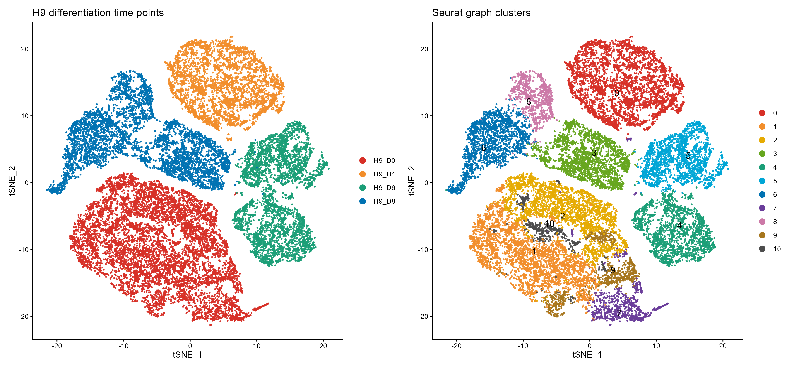
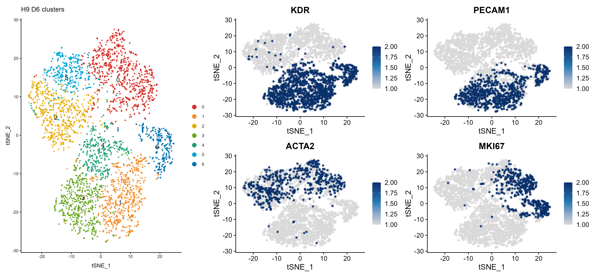
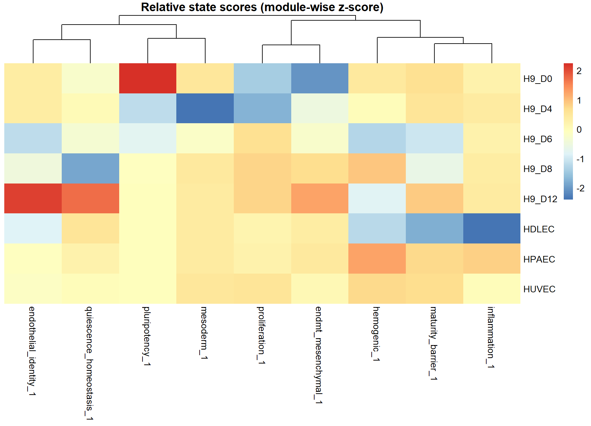

# GSE131736 example results

## Cohort audit

| Cohort | Matrices | Deposited cells | Interpretation |
|---|---:|---:|---|
| H9 Day 0/4/6/8 core | 4 | 21,369 | Main longitudinal trajectory and paper Figure 2A comparison |
| H9 Day 8 rep3–Day 12 | 2 | 13,657 | Separate late-stage comparison; source of Day 12 statements |

## Representative figures

### Core tSNE

**Caption.** H9 Day 0–8 combined tSNE and Seurat graph clusters, compared with Figure 2A of McCracken et al. The deposited matrices contain 21,369 cells before analysis filtering. The new rendering uses current Seurat and a high-contrast palette; exact coordinates may differ because the original full parameter set and historical software environment are not completely recoverable.

### Day 6 marker structure

**Caption.** Separate H9 Day 6 tSNE and marker expression, compared with Figure 1C of McCracken et al. KDR/PECAM1-rich and ACTA2-rich regions support endothelial–mesenchymal branching, while MKI67 shows proliferative heterogeneity.

### Relative state scores

**Caption.** Newly added relative state-module heatmap. It summarizes endothelial identity, barrier/maturity, quiescence, proliferation, inflammation, EndMT/mesenchymal, and related programs across samples. Scores are standardized within modules and are intended for hypothesis generation, not proof of functional maturity.

## Interpretation boundary

Reference endothelial samples differ by tissue source and batch. Several groups have limited independent biological replication. Results should therefore be validated in independent datasets and by functional experiments.
